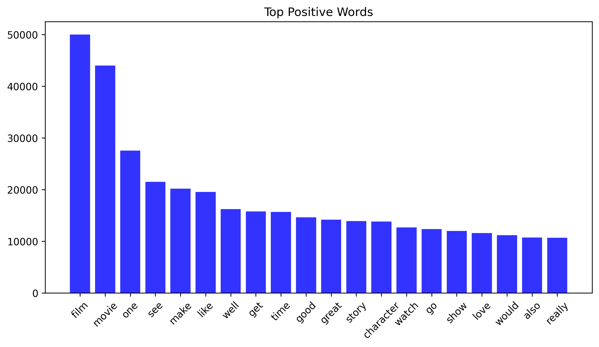
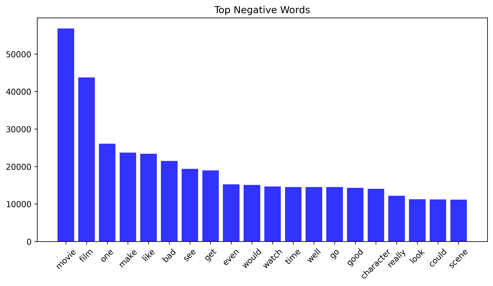
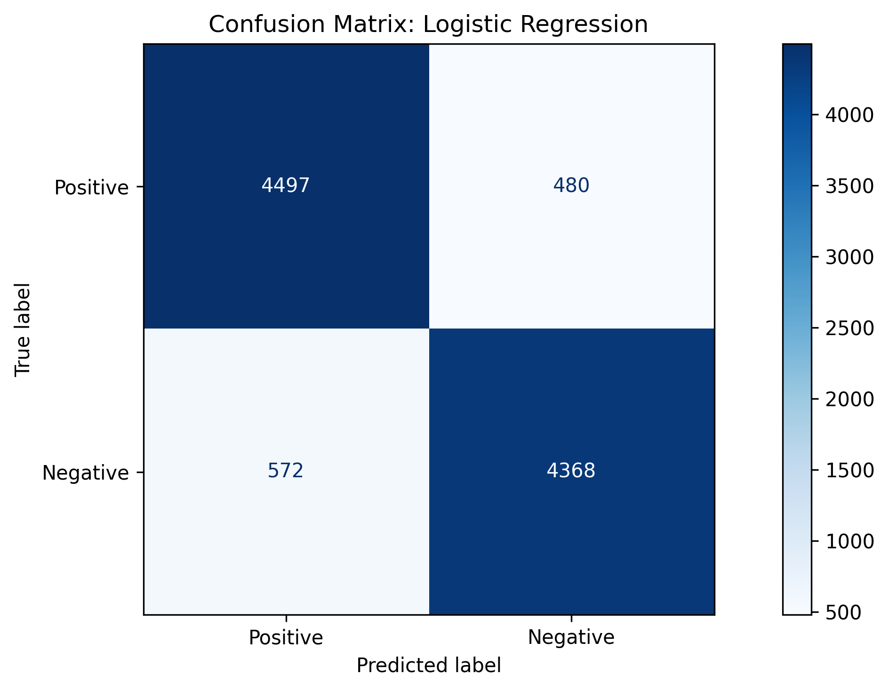

## 🛒 Product Review Sentiment Analysis
This project is a **Natural Language Processing (NLP)** application that classifies product reviews as **positive** or **negative**.

### 🧩 Key Steps:
- Cleaned and preprocessed text (tokenization, stopword removal, lemmatization, etc.)
- Extracted features with **TF-IDF**
- Built a complete **ML pipeline** for preprocessing, feature extraction, and model training
- Trained and compared multiple models:
  - **Logistic Regression** 
  - **Multinomial Naive Bayes**
- Evaluated model performance using **accuracy** and **classification reports**

### 📂 Dataset
The dataset used is the IMDb reviews dataset (50,000+ samples)
- [Kaggle - IMDb Dataset](https://www.kaggle.com/datasets/lakshmi25npathi/imdb-dataset-of-50k-movie-reviews)
- [Google Drive - IMDb Dataset](https://drive.google.com/file/d/1JsU2vlOo1D40xl7SEC7QTgb2GEh38WgN/view?usp=drivesdk)

### 📊 Visualizations
- Most frequent Positive and Negative words (WordCloud)
- Confusion Matrix for both Models
- Compared Model Performances<br>



.png)

| Model | Accuracy | Remarks |
|:---------------------------|:----------:|:----------------------|
| **Logistic Regression** | **89.39%** | 🏆 Best performance |
| Multinomial Naive Bayes | 88.35% | — |


## Dependencies
Before running this project locally, ensure the following are installed:
- Python 3.x
- Streamlit
- NumPy
- Pandas
- Matplotlib
- Seaborn
- BeautifulSoup4
- NLTK
- Scikit-learn
- WordCloud
- Joblib

## 📂 Folder Structure
```
Product-Review-Sentiment-Analysis/
├── app.py               
├── model.joblib         
├── requirements.txt     
├── images/              
│   ├── ...             
└── README.md          
```
## Installing
To install Streamlit:
```sh
pip install streamlit
```
To install all required dependencies:
```sh
pip install -r requirements.txt
```

## Running the Application Locally
```sh
streamlit run app.py
```
Then open the local URL (usually http://localhost:8501/) in your browser.

## Try the App Online
You can use the app directly here: [Live Streamlit App](https://reviewpredictor.streamlit.app/)<br>
Simply type any product review in the input box and click Predict to see the sentiment.

## Features
✅ Real-time sentiment prediction<br>
✅ Clean Streamlit user interface<br>
✅ Machine Learning pipeline with TF-IDF + Logistic Regression / Naïve Bayes<br>
✅ Text preprocessing using NLTK and BeautifulSoup<br>
✅ Interactive and lightweight deployment

## Help
If you encounter any issues:
- Check the [Streamlit Documentation](https://docs.streamlit.io/)
- Search for similar issues or solutions on [Kaggle](https://www.kaggle.com/)
- Open an issue in this repository

## Author
👤 Oluyale Ezekiel
- Email: ezekieloluyale@gmail.com
- LinkedIn: [Ezekiel Oluyale](https://www.linkedin.com/in/ezekiel-oluyale)
- GitHub: [Product Review Sentiment Analysis](https://github.com/amusEcode1/Product_Review_Sentiment_Analysis)
- Twitter: [@amusEcode1](https://x.com/amusEcode1?t=uHxhLzrA1TShRiSMrYZQiQ&s=09)

## Acknowledgments
Thank you, Elevvo, for the incredible opportunity and amazing Internship.
