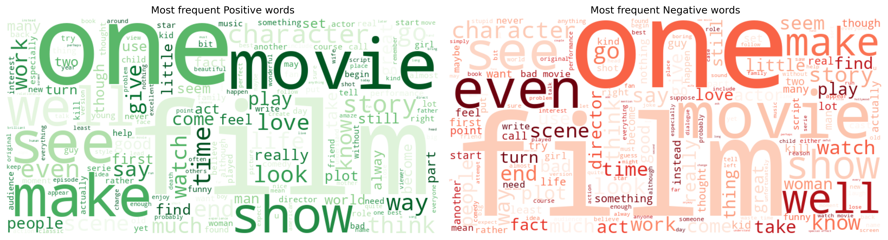

## 🛒 Product Review Sentiment Analysis
This project is a **Natural Language Processing (NLP)** application that classifies product reviews as **positive** or **negative**.

## 🧩 Key Steps:
- Data Cleaning: Tokenization, stopword removal, lemmatization, et.c
- Feature Extraction: Using **TF-IDF** vectorization
- Model Training: Trained and compared multiple models:
  - **Logistic Regression** 
  - **Multinomial Naive Bayes**
- Visualization: Generated word clouds and confusion matrices for both models.
- Evaluation: Measured model accuracy, precision, recall, and F1-score.
- Deployment: Built a simple Streamlit app for interactive prediction.

## 📂 Dataset
The dataset used is the IMDb reviews dataset (50,000+ samples).
- Available on:
  - [Kaggle - IMDb Dataset](https://www.kaggle.com/datasets/lakshmi25npathi/imdb-dataset-of-50k-movie-reviews)
  - [Google Drive - IMDb Dataset](https://drive.google.com/file/d/1JsU2vlOo1D40xl7SEC7QTgb2GEh38WgN/view?usp=drivesdk)

## 📊 Visualizations
- Most frequent Positive and Negative words (WordCloud)
- Confusion Matrix for both Models
- Compared Model Performances

### WordClouds


### Confusion Matrices

.png)

### 📊 Model Performance Comparison
| Model | Accuracy | Remarks |
|:---------------------------|:----------:|:----------------------|
| **Logistic Regression** | **89.39%** | 🏆 Best performance |
| Multinomial Naive Bayes | 88.35% | — |

## 🧠 Tech Stack & Tools: 
- Python (NumPy, Pandas, Matplotlib, Seaborn, WordCloud, BeautifulSoup, NLTK, Scikit-learn)
- Streamlit — for model deployment and visualization

## Dependencies
Before running this project locally, ensure the following are installed:
- Python 3.x
- Streamlit
- NumPy
- Pandas
- Matplotlib
- Seaborn
- BeautifulSoup4
- NLTK
- Scikit-learn
- WordCloud
- Joblib

## Installing
To install Streamlit:
```sh
pip install streamlit
```
To install all required dependencies:
```sh
pip install -r requirements.txt
```

## Running the Application Locally
```sh
streamlit run app.py
```
Then open the local URL (usually http://localhost:8501/) in your browser.

## Try the App Online
You can use the app directly here: [Review Predictor](https://reviewpredictor.streamlit.app/)<br>
Simply type any product review in the input box and click Predict to see the sentiment.

## 📂 Folder Structure
```
Product-Review-Sentiment-Analysis/
├── app.py               
├── model.joblib         
├── requirements.txt     
├── images/              
│   ├── ...             
└── README.md          
```

## Help
If you encounter any issues:
- Check the [Streamlit Documentation](https://docs.streamlit.io/)
- Search for similar issues or solutions on [Kaggle](https://www.kaggle.com/)
- Open an issue in this repository

## Author
👤 Oluyale Ezekiel
- Email: ezekieloluyale@gmail.com
- LinkedIn: [Ezekiel Oluyale](https://www.linkedin.com/in/ezekiel-oluyale)
- GitHub: [Product Review Sentiment Analysis](https://github.com/amusEcode1/Product_Review_Sentiment_Analysis)
- Twitter: [@amusEcode1](https://x.com/amusEcode1?t=uHxhLzrA1TShRiSMrYZQiQ&s=09)

### Acknowledgments
Thank you, Elevvo, for the incredible opportunity and amazing Internship.
